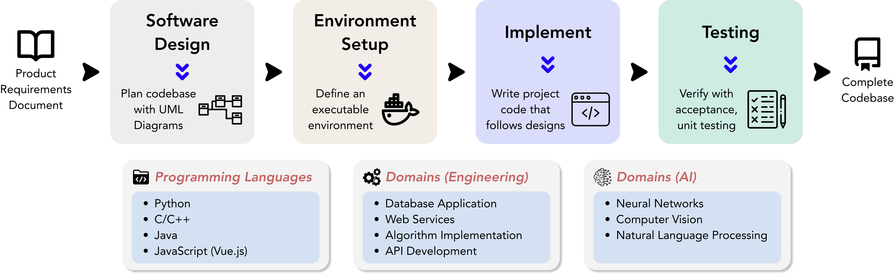
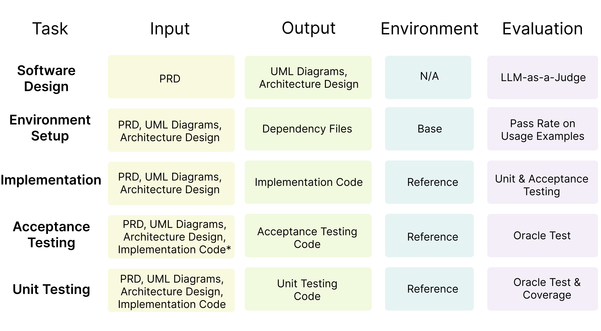

<p align="center">
  
</p>


# DevBench: Towards LLMs based Automated Software Development

  👋 <a href="#-overview">Overview</a> |
  📖 <a href="#-benchmarking-code-llms">Benchmarking</a> |
  ⚙️ <a href="#-set-up-with-docker">Setup</a> |
  🚀 <a href="#-usage">Usage</a> |
  🔎 <a href="#-citation">Citation</a>  |
  📝 <a href="#-license">License</a>

**📬 Contact**: libowen.ne@gmail.com, chao.peng@acm.org


## 👋 Overview

- **DevBench** is a comprehensive benchmark designed to evaluate LLMs across various stages of the software development lifecycle, including *software design*, *environment setup*, *implementation*, *acceptance testing*, and *unit testing*. By integrating these interconnected steps under a single framework, DevBench offers a holistic perspective on the potential of LLMs for automated software development.

- The DevBench dataset comprises **22 curated repositories** across **4 programming languages** (Python, C/C++, Java, JavaScript), covering a wide range of domains such as machine learning, databases, web services, and command-line utilities.

  <p align="center">
  
  </p>

- **DevBench** includes a comprehensive and automatic evaluation suite for all tasks involved. We provide extensive acceptance and unit test cases for the *implementation* task 🤗. Additionally, we utilize [LLM-as-a-Judge](./misc/llm_judge/README.md) for evaluating the *software design* task 👩🏽‍⚖️. Further details on our task specifications can be found [here](./benchmark_data/README.md).

  <p align="center">
  
  </p>

- We have developed a baseline agent system based on the popular multi-agent software development system, [ChatDev](https://github.com/OpenBMB/ChatDev). Special thanks to our collaborators at ChatDev!

## 📖 Benchmarking Code LLMs

### Evaluation results of the coding tasks on DevBench.
<table border-collapse:collapse;border:none;>
    <tr >
        <th style="text-align:center" border: 1px solid black;>Task</th>
        <th style="text-align:center">Environment Setup</th>
        <th colspan="2" style="text-align:center">Implementation</th>
        <th style="text-align:center">Acceptance Testing</th>
        <th colspan="2" style="text-align:center">Unit Testing</th>
    </tr>
     <tr >
        <th style="text-align:center">Evaluation Metric (%)</th>
        <th style="text-align:center">Pass@ Example Usage§</th>
        <th style="text-align:center">Pass@ Accept. Test¶ </th>
        <th style="text-align:center">Pass@ Unit Test¶</th>
        <th style="text-align:center">Oracle Test§</th>
        <th style="text-align:center">Oracle Test§</th>
        <th style="text-align:center">Coverage$</th>
    </tr>
    <tr>
        <td style="text-align:center">Claude3-Opus</td>
        <td style="text-align:center"><em></em></td>
        <td style="text-align:center"></td>
        <td style="text-align:center"></td>
        <td style="text-align:center"></td>
        <td style="text-align:center"></td>
        <td style="text-align:center"></td>
    </tr>
    <tr>
        <td style="text-align:center">GPT-3.5-Turbo</td>
        <td style="text-align:center"><em>33.3</em></td>
        <td style="text-align:center">4.2</td>
        <td style="text-align:center">4.3</td>
        <td style="text-align:center">11.7</td>
        <td style="text-align:center">28.7</td>
        <td style="text-align:center">24.6(61.4)</td>
    </tr>
    <tr>
        <td style="text-align:center">GPT-4-Turbo-1106</td>
        <td style="text-align:center"><em>41.7</em></td>
        <td style="text-align:center">6.9</td>
        <td style="text-align:center">6.8</td>
        <td style="text-align:center">25.9</td>
        <td style="text-align:center">33.6</td>
        <td style="text-align:center">36.7(66.7)</td>
    </tr>
    <tr>
        <td style="text-align:center">GPT-4-Turbo-0125</td>
        <td style="text-align:center"><em>41.7</em></td>
        <td style="text-align:center">7.1</td>
        <td style="text-align:center">8.0</td>
        <td style="text-align:center">29.2</td>
        <td style="text-align:center">36.5</td>
        <td style="text-align:center">33.2(66.3)</td>
    </tr>
    <tr>
        <td style="text-align:center">CodeLlama-7B-Instruct</td>
        <td style="text-align:center"><em>8.3</em></td>
        <td style="text-align:center">0.0</td>
        <td style="text-align:center">0.0</td>
        <td style="text-align:center">0.0</td>
        <td style="text-align:center">3.0</td>
        <td style="text-align:center">3.6(71.0)</td>
    </tr>
    <tr>
        <td style="text-align:center">CodeLlama-13B-Instruct</td>
        <td style="text-align:center"><em>25.0</em></td>
        <td style="text-align:center">0.6</td>
        <td style="text-align:center">0.0</td>
        <td style="text-align:center">0.0</td>
        <td style="text-align:center">5.1</td>
        <td style="text-align:center">8.6(57.6)</td>
    </tr>
    <tr>
        <td style="text-align:center">CodeLlama-34B-Instruct</td>
        <td style="text-align:center"><em>16.7</em></td>
        <td style="text-align:center">0.6</td>
        <td style="text-align:center">0.5</td>
        <td style="text-align:center">4.5</td>
        <td style="text-align:center">21.1</td>
        <td style="text-align:center">25.4(72.6)</td>
    </tr>
    <tr>
       <tr>
        <td style="text-align:center">DeepSeek-Coder-1.3B-Instruct</td>
        <td style="text-align:center"><em>8.3</em></td>
        <td style="text-align:center">0.0</td>
        <td style="text-align:center">0.1</td>
        <td style="text-align:center">0.0</td>
        <td style="text-align:center">5.6</td>
        <td style="text-align:center">2.7(27.0)</td>
      </tr>
    <tr>
        <td style="text-align:center">DeepSeek-Coder-6.7B-Instruct</td>
        <td style="text-align:center"><em>25.0</em></td>
        <td style="text-align:center">2.9</td>
        <td style="text-align:center">3.9</td>
        <td style="text-align:center">20.5♡</td>
        <td style="text-align:center">23.5</td>
        <td style="text-align:center">28.2(70.6)</td>
    </tr>
    <tr>
        <td style="text-align:center">DeepSeek-Coder-33B-Instruct</td>
        <td style="text-align:center"><em>16.7</em></td>
        <td style="text-align:center">4.4</td>
        <td style="text-align:center">5.5</td>
        <td style="text-align:center">13.6</td>
        <td style="text-align:center">32.8</td>
        <td style="text-align:center">35.7(79.4)</td>
      </tr>
    </tr>

</table>
Italic figures: test cases for the Environment Setup task are scarce compared to other tasks, therefore the results are more influenced by the randomness. §: all results are averaged across all repositories and weighted uniformly. ¶: all results are averaged across all repositories and weighted by the number of code lines. $: the results on the left side are averaged across all repositories and weighted uniformly, showing the overall scores. The results on the right side in the parenthesis are averaged across all valid repositories and weighted uniformly, where models have generated executable testing code. ♡: the model has generated meaningless but executable testing code.

### Evaluation results of the software design on DevBench.

The code for the software design evaluation can be found [here](./misc/llm_judge/)👩🏽‍⚖️.

<table align="center">
     <tr>
        <td rowspan="2"></td>
        <td colspan="2" style="text-align:center"><b>w/ Tie</b></td>
        <td colspan="2" style="text-align:center"><b>w/o Tie</b></td>
    </tr>
    <tr>
        <th style="text-align:center">General Principles† </th>
        <th style="text-align:center">Faithfulness‡</th>
        <th style="text-align:center">General Principles</th>
        <th style="text-align:center">Faithfulness</th>
    </tr>
    <tr>
        <td style="text-align:center">GPT-4-Turbo</td>
        <td style="text-align:center">91.7</td>
        <td style="text-align:center">85.4</td>
        <td style="text-align:center">100.0</td>
        <td style="text-align:center">100.0</td>
    </tr>
    <tr>
        <td style="text-align:center">CodeLlama-7B-Instruct</td>
        <td style="text-align:center">4.2</td>
        <td style="text-align:center">8.3</td>
        <td style="text-align:center">4.2</td>
        <td style="text-align:center">4.5</td>
    </tr>
    <tr>
        <td style="text-align:center">CodeLlama-13B-Instruct</td>
        <td style="text-align:center">18.8</td>
        <td style="text-align:center">14.6</td>
        <td style="text-align:center">10.5</td>
        <td style="text-align:center">5.3</td>
    </tr>
    <tr>
        <td style="text-align:center">CodeLlama-34B-Instruct</td>
        <td style="text-align:center">39.6</td>
        <td style="text-align:center">33.3</td>
        <td style="text-align:center">33.3</td>
        <td style="text-align:center">21.4</td>
    </tr>
    <tr>
        <td style="text-align:center">DeepSeek-Coder-1.3B-Instruct</td>
        <td style="text-align:center">16.7</td>
        <td style="text-align:center">16.7</td>
        <td style="text-align:center">5.5</td>
        <td style="text-align:center">5.6</td>
    </tr>
    <tr>
        <td style="text-align:center">DeepSeek-Coder-6.7B-Instruct</td>
        <td style="text-align:center">35.4</td>
        <td style="text-align:center">35.4</td>
        <td style="text-align:center">31.6</td>
        <td style="text-align:center">29.4</td>
    </tr>
    <tr>
        <td style="text-align:center">DeepSeek-Coder-33B-Instruct</td>
        <td style="text-align:center">52.1</td>
        <td style="text-align:center">50.0</td>
        <td style="text-align:center">53.8</td>
        <td style="text-align:center">50.0</td>
    </tr>
    <tr>
        <td style="text-align:center">Agree w/ Human Majority</td>
        <td style="text-align:center">60.4</td>
        <td style="text-align:center">51.6</td>
        <td style="text-align:center">79.2</td>
        <td style="text-align:center">83.2</td>
    </tr>
      
</table>
Win rate of pairwise comparison against GPT-3.5-Turbo on Software Desgin on a subset of DevBench where results are averaged across different repositories and sub-tasks uniformly.†: the general principles metric. ‡: the faithfulness metric. w/ Tie: inconsistent results are considered as a tie. We also report agreement with Human Majority.

## 🐳 Set Up with Docker

For a secure and isolated environment, we offer Docker support for DevBench. Please refer to our detailed [Installation Guide](./wiki.md#installation-guide).

## 🚀 Usage

### 1. Prepare the environment variables

Add your DevBench directory to your PYTHONPATH variable.

```
export PYTHONPATH="${PYTHONPATH}:${path_to_devbench}"
```

For running the `benchmark_data/java/Actor_relationship_game` repo, configure your TMDB key.

```
export TMDB_API_KEY=${your_TMDB_key}
```
### 2. Prepare the chat models

#### OpenAI GPT models
Set your OpenAI API key as an environment variable.

```
export OPENAI_API_KEY="your_OpenAI_API_key"
```

#### Open source models

For deploying open source models, please refer to [lmdeploy](https://github.com/InternLM/lmdeploy/tree/main) or [vllm](https://github.com/vllm-project/vllm).

After the deployment, please configure the IP address in `open_source_model.json`.

For codellama and deepseek-coder models, which are integrated into our experiments, simply fill in the IP address in `{"model_name": $model_ip_address}`.

For example：

```
{
  "codellama-7b-instruct": "",
  "codellama-13b-instruct": "",
  "codellama-34b-instruct": "",
  "deepseek-coder-1.3b-instruct": "",
  "deepseek-coder-6.7b-instruct": "",
  "deepseek-coder-33b-instruct": "$model_ip_address"
}
```

For additional models, add a new field as shown below.

```
{
  "customized-model": {"$model_name": "$model_ip_address"}
}
```

### 3. **Run the agent system**
#### Run script

```
cd agent_sysyem/baseline
python run.py --config Implementation --input_path ../../benchmark_data/python/TextCNN/ --model gpt-4-turbo-new --model_source openai  --review execution --evaluate
```

#### Parameters

- config (*str*) - Specifies the task in the DevBench: `SoftwareDesign` | `EnvironmentSetup` | `Implementation` | `AcceptanceTesting` | `UnitTesting`. 
- input_path (*str*) - Specifies the repo path.
- project_name (*str*) - Specifies the repo name. If empty, defaults to the last segment of `input_path` (i.e., `input_path.split('/')[-1]`)
- model (*str*) - Specifies the name of the language model: `gpt-3.5-turbo` | `gpt-4` | `gpt-4-32k` | `gpt-4-turbo` | `claude-2` | `claude-2.1` | `codellama-7b` | `codellama-13b` | `codellama-34b` | `deepseek-coder-1.3b` | `deepseek-coder-6.7b` | `deepseek-coder-33b` | `customized-model`.
- model_source (*str*) - Specifies the model type, open source model or openai closed source model : `open_source` ｜ `openai`
- review (*str*) - Specifies the review mode: `none` | `normal` | `execution`.     
  - `none`: a single forward pass of Coding. 
  - `normal`: Coding and CodeReview in alternation, with CodeReview lacking program execution feedback.
  - `execution`: Coding and CodeReview in alternation, with CodeReview including program execution feedback.
- read_src_code (*bool*) - Whether to read source code in the AcceptanceTesting and UnitTesting tasks.
- evaluate (*bool*) - Whether to evaluate in the end. The evaluation for the software design can be found [here](./misc/llm_judge/).
- temperature (*float*) - temperature
- top_p (*float*) - top_p

When you use normal review and execution review, the `cyclenum` parameter of `CompanyConfig/{task_name}/ChatChainConfig.json` can be specified as the number of rounds of review. The default is 2.

<!-- ## ✨️ Test Your Own Tasks

## 🤗 Share Your Repos -->

## 🔎 Citation

```
xxx
```

## 📝 License

- Source Code Licensing: Our project's source code is licensed under the Apache 2.0 License. This license permits the use, modification, and distribution of the code, subject to certain conditions outlined in the Apache 2.0 License.
- Data Licensing: The related data utilized in our project is licensed under CC BY 4.0, which allows anyone to copy, distribute, transmit, adapt and make commercial use of the dataset.

