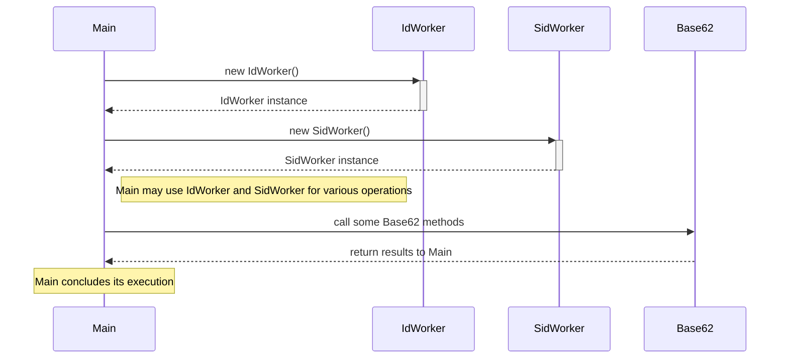

# UML sequence

```mermaid
sequenceDiagram
participant Main
participant IdWorker
participant SidWorker
participant Base62

    Main->>+IdWorker: new IdWorker()
    IdWorker-->>-Main: IdWorker instance

    Main->>+SidWorker: new SidWorker()
    SidWorker-->>-Main: SidWorker instance

    Note right of Main: Main may use IdWorker and SidWorker for various operations

    Main->>Base62: call some Base62 methods
    Base62-->>Main: return results to Main

    Note over Main: Main concludes its execution
```
