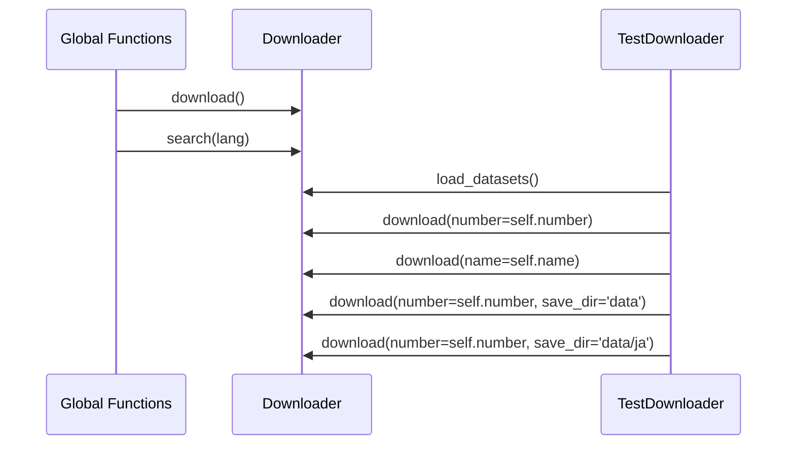

# UML_sequence
`Global_functions` is a fake class to host global functions. Here, it's used to demonstrate the usage of the `download` and `search` functions in the `chakin` package's `__init__.py`.

