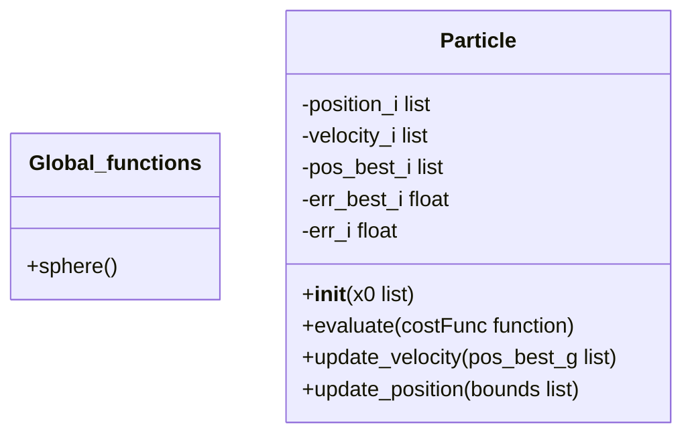

# UML class

```mermaid
classDiagram
    class Global_functions {
        +sphere()
    }
    class Particle {
        -position_i list
        -velocity_i list
        -pos_best_i list
        -err_best_i float
        -err_i float
        +__init__(x0 list)
        +evaluate(costFunc function)
        +update_velocity(pos_best_g list)
        +update_position(bounds list)
    }
```